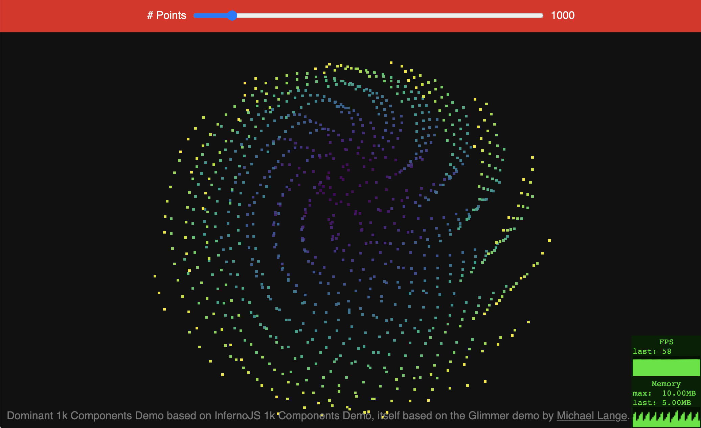

#  Dominant – Dysfunctional JavaScript UIs

[React](http://reactjs.org) has been truly revolutionary back in the day, and it's taught us many important lessons, but I think it's about time we move on, and I'm not excited about any of the existing alternatives as they're all similarly complex.

I need a UI library that allows me to create components bound to mutable JavaScript state, that's it.

I can call an update function whenever state changes (à la [Mithril](https://mithril.js.org)), so there's no need to track changes.

  * This means no special APIs for changing state; just mutate your variables and objects.
  * Also no observables or hacky object property/array method monkey-patching (like [Aurelia](https://aurelia.io) and [VueJS](https://vuejs.org) do).
  * A global **update** function reevaluates all bindings and updates the DOM strictly as needed.

It should let me leverage DOM APIs, not abstract them away.

  * This means no virtual DOM.
  * It also means there's no **mount** function; components are just functions or classes with render functions that return DOM nodes you can compose using a familiar [Hyperscript](https://github.com/hyperhype/hyperscript)-like API and append wherever.
  * A DOM [mutation observer](https://developer.mozilla.org/en-US/docs/Web/API/MutationObserver) keeps track of which DOM nodes with bindings are attached to the document and calls lifecycle listeners (**attach**/**detach**, if any).
  * This plays well with other DOM-based UI libraries, such as vanilla JS components and jQuery UI.
  * Finally, the API is JSX-compatible.

To-Do App demo:

[](https://dominant-demos.netlify.app/todoapp)

Performance demo:

[](https://dominant-demos.netlify.app/1kcomponents)

## Setup

The easiest way to bootstrap a Dominant project is to use [Create Dominant App](https://www.npmjs.com/package/create-dominant-app).
If you have npm installed, the following command is all that's necessary:

```sh
# Replace your-app-name with the desired project name.
$ npm init dominant-app your-app-name
```

npm will automatically install [create-dominant-app](https://www.npmjs.com/package/create-dominant-app) and run it for you.
`create-dominant-app` will create your new app directory, initialize `package.json` in it, and install all the necessary dependencies.

Once the script finishes, you'll be able to change into the newly created directory and start the development server:

```sh
$ cd your-app-name
$ npm start
```

Then open http://localhost:5000/ to see your app.<br>
When you're ready to deploy to production, create a minified bundle with `npm run build`.

## API

### d.el(tagName | fn | Component, { props }?, ...children)

All JSX tags are automatically converted into calls to this function. It creates a DOM element of the specified tag name (`tagName`), function (`fn`), or class (`Component`).

When a tag name is supplied, key/values in the (optional) **props** object can be used to set an element's attributes, properties, bindings, and event listeners.

Also any **children** (optional) are appended to the created element.

When a component function or class is supplied, any  **children** supplied are stored in `props.children` before **props** is forwarded to the component function or class constructor.

When a component function is supplied, the return value of `fn(props)` is returned.

When a component class is supplied, the return value of `new Component(props).render()` is returned.

```jsx
// Example variables, see their usage below:
let shouldHideDiv = false;

let someImage = {
  alt: 'GNU logo',
  src: 'https://www.gnu.org/graphics/heckert_gnu.transp.small.png',
};

let isThirsty = true;
let someBgColorVariable = 'yellow';
let currentInputValue = 'hello';

document.body.append(
  // Static prop examples:
  <div class="foo bar">foobar</div>,
  <input type="text" value="foo" />,
  ,
  <button onClick={() => alert('quux')}>Click me</button>,

  // Dynamic prop examples (one-way bindings):
  <div hidden={() => shouldHideDiv} />,
   someImage.description} src={() => someImage.url} />,

  // Static style prop example:
  <div style={{
    width: '40px',
    height: '40px',
    border: '1px solid red',
    backgroundColor: 'blue',
  }} />,

  // Dynamic class and style props example (one-way bindings):
  <div
    class={[
      'foo', // foo class will be statically added to the element on first render.
      () => isThirsty && 'bar', // bar class will be dynamically added/removed according to isThirsty.
    ]}

    style={{
      // width, height, and border are all gonna be statically set on the element on first render.
      width: '40px',
      height: '40px',
      border: '1px solid red',

      // backgroundColor will be dynamically bound to someBgColorVariable.
      backgroundColor: () => someBgColorVariable,
    }}
  />,

  // Input value prop example (two-way binding):
  <input
    value={d.binding({
      get: () => currentInputValue,
      set: x => currentInputValue = x,
    })}
  />,
);

// Component function:
const HelloFn = ({ whom }) => d.text(() => `Hello, ${d.resolve(whom)}!`);
document.body.append(<HelloFn whom="functions" />);

// Component class (with d.resolving property getter `this.whom`):
class HelloClass extends d.Component {
  constructor(props) {
    super();
    this.props = props;
  }

  // This getter calls `d.resolve(this.props.whom)` internally so you don't have
  // to do that every time you want `this.props.whom`'s resolved value. See
  // `d.resolve`'s documentation below.
  get whom() {
    return d.resolve(this.props.whom);
  }

  render = () => d.text(() => `Hello, ${this.whom}!`);
}

document.body.append(<HelloClass whom="classes" />);
```

**Note:** Dominant has no way of knowing when your application's state changes.
It's up to you to call **d.update()** after any known or potential state changes.

### d.resolve(x)

This helper function will call **x** if it's a function, or just return **x** itself otherwise. That is:

```jsx
d.resolve(() => 123); // returns 123.
d.resolve(123); // also returns 123.
```

This is useful when you're writing a component which may receive a regular value as prop or a getter function that works as a live reference to some expression in the getter function's scope. E.g.:


```jsx
let name = 'John Doe';

// Since we're passing `name` here directly, we're actually passing `name`'s
// current value as a constant.
document.body.append(<HelloFn whom={name} />);

// I.e., this has no effect:
name = 'Jane Doe';
d.update();

// If we pass a getter function, on the other hand, HelloFn can call it anytime
// to get the most up-to-date value:
document.body.append(<HelloFn whom={() => name} />);

// So this causes the UI to update accordingly:
name = 'Foo Bar';
d.update();
```

### d.update()

Reevaluates all DOM data bindings set with **d.el**, executing all the supplied functions and comparing return values with the ones from previous invocations.

Only bindings whose values have changed since the last invocation are applied to the DOM.

```jsx
let color = 'blue';
let whom = 'world';

setTimeout(() => {
  color = 'red';
  whom = 'human';

  d.update();
}, 1000);

document.body.append(
  <div style={{ color: () => color }}>
    Hello, {d.text(() => whom)}!
  </div>
);
```

### d.text(fn)

Returns a DOM text node with contents bound to the supplied **fn**.

Whenever **d.update** gets called, text bindings are reevaluated, meaning the supplied functions are reexecuted and their return values are compared to the return values from previous invocations.

Only text bindings whose values have changed since the last invocation are updated in the DOM.

```jsx
let whom = 'world';

setTimeout(() => {
  whom = 'human';
  d.update();
}, 1000);

document.body.append(d.text(() => `Hello, ${whom}!`));
```

### d.if(predFn, thenNode, elseNode)

Returns a conditional anchor comment node (`<!-- anchorComment: if -->`) that represents a conditional node attachment in the document.

When updated, the binding calls `predFn` and adds `thenNode` as its next sibling if the result is truthy, `elseNode` otherwise.

Note: Nodes, including anchor comment nodes, are automatically updated when attached to the document (`d.mutationObserver` does this).

```jsx
let isNewVisitor = true;

document.body.append(d.if(
  () => isNewVisitor,
  <div>Nice to meet you!</div>,
  <div>Welcome back!</div>,
));

setTimeout(() => {
  isNewVisitor = false;
  d.update();
}, 1000);
```

### d.map(arrayFn, fn)

The `array.map(fn)` analog to `d.if`.

When updated, the binding calls `arrayFn`, removes nodes associated to removed array values, reorders nodes to match the order of associated values in the new array, maps new values to new nodes using `fn`, and adds them to the DOM.

```jsx
let fruits = [
  { name: 'Apple', color: 'Red' },
  { name: 'Grape', color: 'Purple' },
  { name: 'Lime', color: 'Green' },
];

let wikipediaPagePrefix = 'https://en.wikipedia.org/wiki';

document.body.append(d.map(
  () => fruits, fruit => (
    <li>
      The <a href={() => `${wikipediaPagePrefix}/${fruit.name}`}>
        {d.text(() => fruit.name)}
      </a> is <a href={() => `${wikipediaPagePrefix}/${fruit.color}`}>
        {d.text(() => fruit.color)}
      </a>.
    </li>
  ),
));
```

## License

### ISC (Internet Systems Consortium)

Dominant is free software: you can redistribute it and/or modify it under the terms of the [ISC License](COPYING).

## Exclusion of warranty

THE SOFTWARE IS PROVIDED "AS IS" AND THE AUTHOR DISCLAIMS ALL WARRANTIES WITH REGARD TO THIS SOFTWARE INCLUDING ALL IMPLIED WARRANTIES OF MERCHANTABILITY AND FITNESS. IN NO EVENT SHALL THE AUTHOR BE LIABLE FOR ANY SPECIAL, DIRECT, INDIRECT, OR CONSEQUENTIAL DAMAGES OR ANY DAMAGES WHATSOEVER RESULTING FROM LOSS OF USE, DATA OR PROFITS, WHETHER IN AN ACTION OF CONTRACT, NEGLIGENCE OR OTHER TORTIOUS ACTION, ARISING OUT OF OR IN CONNECTION WITH THE USE OR PERFORMANCE OF THIS SOFTWARE.
